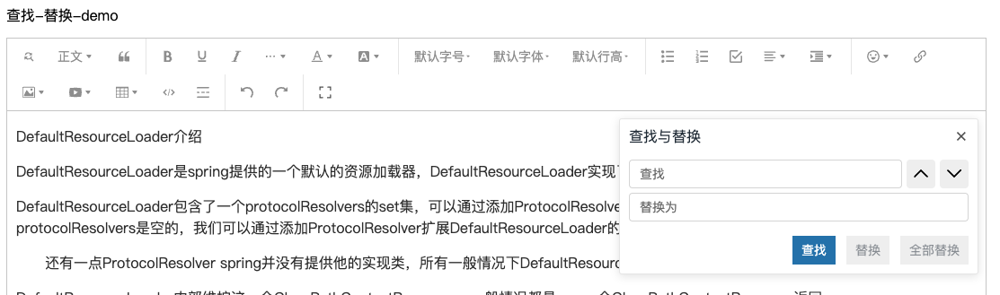

# wangEdiotr-plugin-find-replace

## 介绍

这是一个用于在wangEditor中进行查找和替换的插件。


## 安装

```shell
npm install wangEditor-plugin-find-replace
```

## 使用

### 注册到编辑器

```js
import { Boot } from '@wangeditor/editor'
import findReplaceModule from 'wangEditor-plugin-find-replace'

// 注册。要在创建编辑器之前注册，且只能注册一次，不可重复注册。
Boot.registerModule(findReplaceModule)
```

### 配置

```js
const toolbar = createToolbar({
  editor,
  selector: '#toolbar-container',
  config: {
    insertKeys: {
      index: 0,
      keys: ['findReplace'],
    },
  },
})
```